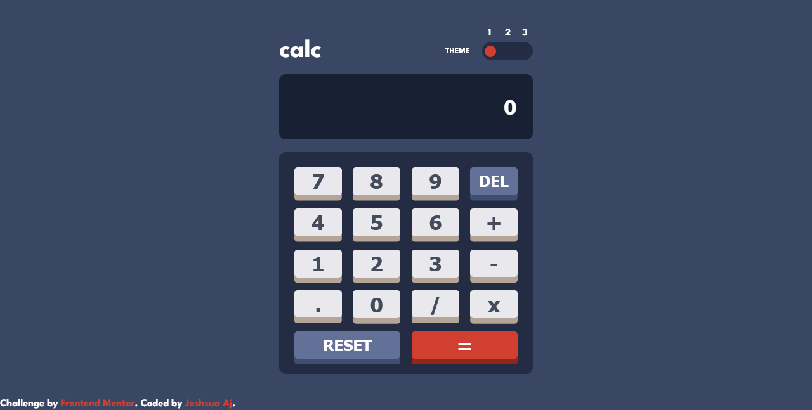

# Frontend Mentor - Calculator app solution

This is a solution to the [Calculator app challenge on Frontend Mentor](https://www.frontendmentor.io/challenges/calculator-app-9lteq5N29). Frontend Mentor challenges help you improve your coding skills by building realistic projects. 

## Table of contents

- [Overview](#overview)
  - [The challenge](#the-challenge)
  - [Screenshot](#screenshot)
  - [Links](#links)
- [My process](#my-process)
  - [Built with](#built-with)

  - [Continued development](#continued-development)

- [Author](#author)

## Overview

### The challenge

Users should be able to:

- See the size of the elements adjust based on their device's screen size
- Perform mathmatical operations like addition, subtraction, multiplication, and division
- Adjust the color theme based on their preference
- **Bonus**: Have their initial theme preference checked using `prefers-color-scheme` and have any additional changes saved in the browser

### Screenshot

### Links

- Solution URL: [Add solution URL here](https://your-solution-url.com)
- Live Site URL: [Add live site URL here](https://your-live-site-url.com)

## My process

### Built with

- Semantic HTML5 markup
- CSS custom properties
- Flexbox
- CSS Grid
- Javascript
- SASS
- Mobile-first workflow

### Useful resources

- [How to build a calculator by Doro Onome](https://www.section.io/engineering-education/building-a-calculator-a-javascript-project-for-beginners/) - This helped me in creating the logical workflow of how the calculator worked using ES6 concepts like classes and objects. I really liked this pattern and will use it going forward.

## Author

- Website - [Joshua Ajorgbor](https://www.your-site.com)
- Frontend Mentor - [@joshuaAj003](https://www.frontendmentor.io/profile/joshuaAj003)
- Twitter - [@JAjorgbor](https://www.twitter.com/JAjorgbor)
